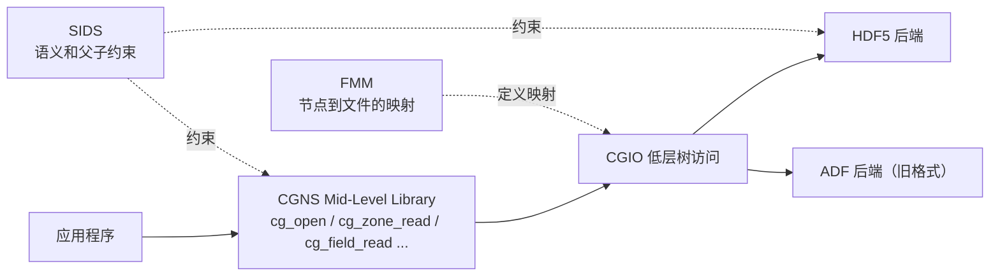
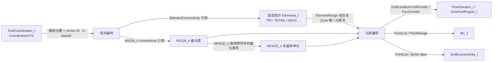
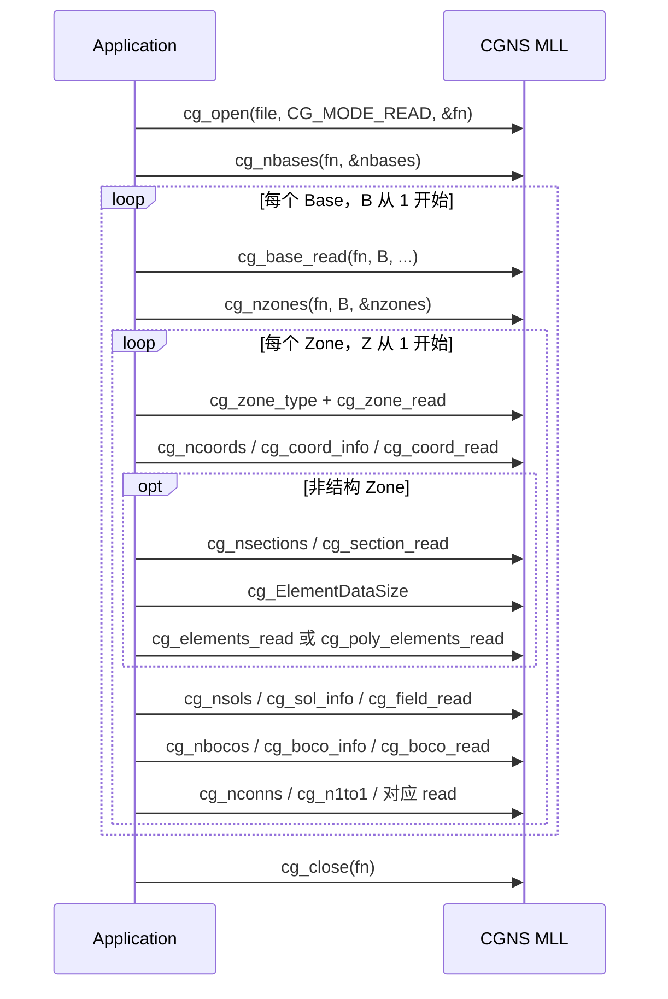
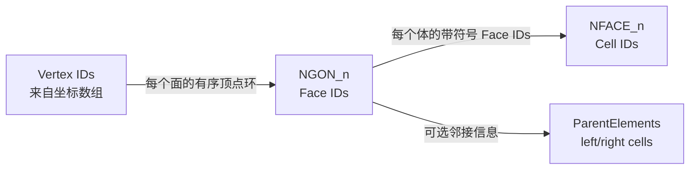

# CGNS 数据结构与 C API 指南

> 本文面向需要读取、写入或检查 CGNS 文件的开发者。内容以 CGNS 4.x 的 SIDS（Standard Interface Data Structures）和 Mid-Level Library（MLL）为基准；不同版本新增的枚举和接口应以实际使用版本的 `cgnslib.h` 为准。

## 1. CGNS 是什么

CGNS（CFD General Notation System）同时定义了三件事：

1. **逻辑数据模型**：网格、单元、边界条件、流场、时间步等对象应该怎样组织，这部分由 SIDS 定义。
2. **文件映射**：逻辑节点怎样映射为树状文件节点，这部分由 FMM（File Mapping Manual）定义。
3. **访问接口**：应用程序如何通过 C/Fortran API 读写这些节点，常用的是 MLL。

CGNS 文件通常使用 HDF5 作为物理存储后端，旧文件也可能使用 ADF。HDF5 group/dataset 只是存储形式，节点名称、标签、父子位置和数据布局仍必须满足 CGNS 标准。



实践中应优先使用 MLL。直接使用 HDF5 API 虽然能够看到 group 和 dataset，却会绕过 CGNS 的版本兼容、枚举解释、链接处理和结构校验。

## 2. 节点模型

CGNS 是一棵有类型的树。每个节点都可以抽象为：

| 属性 | 含义 |
|---|---|
| `Name` | 节点实例名，例如 `Base`、`Zone1`、`CoordinateX`；同一父节点下必须唯一 |
| `Label` | 节点类型，例如 `CGNSBase_t`、`Zone_t`、`DataArray_t`；决定节点语义 |
| `DataType` | 节点自身数据类型，如 `I4`、`I8`、`R4`、`R8`、`C1`、`MT` |
| `Dimensions` | 节点数据的维数和每一维长度 |
| `Data` | 节点保存的标量、数组、枚举值或字符串 |
| `Children` | 子节点列表 |
| `Link` | 可选，指向本文件或外部文件中的其他节点 |

必须区分 `Name` 和 `Label`。例如用户可以把某个 `Zone_t` 命名为 `Fluid`，但它的标签仍然是 `Zone_t`。大部分 MLL 遍历接口使用“类型索引”，泛型导航接口则按 `Label + index` 或完整路径定位。

常见约定：

- CGNS 名称通常最多 32 个字符；C 缓冲区应至少为 `CG_MAX_NAME_LENGTH + 1`。
- MLL 中 Base、Zone、Section、Solution 等索引都是 **从 1 开始**。
- 网格顶点号、单元号和面号也是 **从 1 开始**。
- 大规模网格索引使用 `cgsize_t`，不要用 `int` 代替。
- 数组的内存布局遵循 CGNS/Fortran 约定；多维范围和 C 数组下标不要混为一谈。

## 3. 内部数据结构及父子关系

### 3.1 主层次结构

下图的实线表示实际父子关系，`0..N`/`1..N` 表示常见基数。为便于阅读，只展示 CFD 网格与结果处理中最重要的节点。

```mermaid
flowchart TB
    ROOT["CGNS tree root"]
    VER["CGNSLibraryVersion_t<br/>标准版本"]
    BASE["CGNSBase_t [1..N]<br/>CellDimension, PhysicalDimension"]

    ROOT --> VER
    ROOT --> BASE

    BASE --> ZONE["Zone_t [0..N]<br/>VertexSize, CellSize, BoundaryVertexSize"]
    BASE --> BIT["BaseIterativeData_t [0..1]<br/>时间值 / 迭代值"]
    BASE --> FAMILY["Family_t [0..N]<br/>几何族 / 边界族"]
    BASE --> EQ["FlowEquationSet_t [0..1]"]
    BASE --> REF["ReferenceState_t [0..1]"]
    BASE --> BMeta["DataClass_t / DimensionalUnits_t<br/>SimulationType_t / ConvergenceHistory_t"]

    ZONE --> ZTYPE["ZoneType_t [1]<br/>Structured 或 Unstructured"]
    ZONE --> GRID["GridCoordinates_t [0..N]"]
    ZONE --> ELEM["Elements_t [0..N]<br/>非结构网格单元分区"]
    ZONE --> SOL["FlowSolution_t [0..N]"]
    ZONE --> ZBC["ZoneBC_t [0..1]"]
    ZONE --> ZGC["ZoneGridConnectivity_t [0..N]"]
    ZONE --> SUB["ZoneSubRegion_t [0..N]"]
    ZONE --> ZIT["ZoneIterativeData_t [0..1]"]
    ZONE --> MOTION["RigidGridMotion_t / ArbitraryGridMotion_t [0..N]"]

    GRID --> COORD["DataArray_t [1..N]<br/>CoordinateX / Y / Z ..."]
    GRID --> GRIND["Rind_t [0..1]"]

    ELEM --> ERANGE["IndexRange_t: ElementRange [1]"]
    ELEM --> ECONN["DataArray_t: ElementConnectivity [1]"]
    ELEM --> EOFF["DataArray_t: ElementStartOffset<br/>MIXED / NGON_n / NFACE_n 必需"]
    ELEM --> PE["DataArray_t: ParentElements [0..1]"]
    ELEM --> PEP["DataArray_t: ParentElementsPosition [0..1]"]

    SOL --> LOC["GridLocation_t [0..1]<br/>Vertex / CellCenter / FaceCenter ..."]
    SOL --> FIELD["DataArray_t [0..N]<br/>Density / Pressure / VelocityX ..."]
    SOL --> SPOINT["PointList / PointRange [0..1]"]
    SOL --> SRIND["Rind_t [0..1]"]

    ZBC --> BC["BC_t [0..N]"]
    BC --> BCLOC["GridLocation_t [0..1]"]
    BC --> BCPOINT["PointList / PointRange [1]"]
    BC --> BCFAM["FamilyName_t [0..1]"]
    BC --> BCDS["BCDataSet_t [0..N]"]
    BCDS --> BCDATA["BCData_t [0..2]<br/>Dirichlet / Neumann"]
    BCDATA --> BCARRAY["DataArray_t [0..N]"]

    ZGC --> G1["GridConnectivity1to1_t [0..N]"]
    ZGC --> GG["GridConnectivity_t [0..N]"]
    ZGC --> HOLE["OversetHoles_t [0..N]"]
```



对应的紧凑文本树如下，未支持 Mermaid 的阅读器也可以查看：

```text
CGNS tree root
├─ CGNSLibraryVersion_t
└─ CGNSBase_t [1..N]
   ├─ BaseIterativeData_t
   ├─ Family_t [0..N]
   ├─ FlowEquationSet_t / ReferenceState_t / units / metadata
   └─ Zone_t [0..N]
      ├─ ZoneType_t
      ├─ GridCoordinates_t [0..N]
      │  ├─ DataArray_t: CoordinateX/Y/Z
      │  └─ Rind_t
      ├─ Elements_t [0..N]
      │  ├─ ElementRange
      │  ├─ ElementConnectivity
      │  ├─ ElementStartOffset
      │  └─ ParentElements / ParentElementsPosition
      ├─ FlowSolution_t [0..N]
      │  ├─ GridLocation_t
      │  ├─ PointList / PointRange
      │  ├─ DataArray_t: flow fields
      │  └─ Rind_t
      ├─ ZoneBC_t
      │  └─ BC_t [0..N]
      │     ├─ GridLocation_t + PointList/PointRange
      │     └─ BCDataSet_t -> BCData_t -> DataArray_t
      ├─ ZoneGridConnectivity_t
      │  ├─ GridConnectivity1to1_t
      │  ├─ GridConnectivity_t
      │  └─ OversetHoles_t
      ├─ ZoneSubRegion_t [0..N]
      └─ ZoneIterativeData_t
```

### 3.2 数据之间的引用关系

父子关系只说明“存放在哪里”，还需要理解数组之间如何通过编号关联。非结构网格的核心关系如下：



这里有三个容易混淆的“编号空间”：

- **MLL 对象索引**：`B`、`Z`、`S`、`F` 等，表示第几个 Base/Zone/Section/Field，从 1 开始，只用于 API 定位。
- **顶点编号**：`ElementConnectivity` 中的普通节点号，指向坐标数组中的位置，从 1 开始。
- **元素编号**：由各 `Elements_t/ElementRange` 定义，在同一 Zone 内全局唯一；面、边、体单元共享这个编号空间。

### 3.3 Base 与 Zone 的尺寸

`CGNSBase_t` 保存：

- `CellDimension`：网格单元的拓扑维数，例如体网格为 3，平面/曲面网格为 2。
- `PhysicalDimension`：坐标空间维数，例如嵌入三维空间的曲面网格可为 `CellDimension=2`、`PhysicalDimension=3`。

`Zone_t` 的 `size` 解释取决于 `ZoneType_t`：

| Zone 类型 | `IndexDimension` | `cg_zone_read` 返回的 `size` |
|---|---:|---|
| `Structured` | 等于 `CellDimension` | 三组长度均为 `IndexDimension`：顶点尺寸、单元尺寸、边界顶点尺寸 |
| `Unstructured` | 固定为 1 | `size[0]=NVertex`，`size[1]=NCell`，`size[2]=NBoundaryVertex` |

对三维结构网格，通常有 `CellSize = VertexSize - [1, 1, 1]`。非结构 Zone 的 `NCell` 只统计与 Base 的 `CellDimension` 相同的最高维单元，不等于所有 `Elements_t` 中边、面、体元素数量之和。

### 3.4 坐标、解和位置

- `GridCoordinates_t` 下每个 `DataArray_t` 保存一个坐标分量，常用标准名为 `CoordinateX`、`CoordinateY`、`CoordinateZ`。
- 一个 `FlowSolution_t` 中的字段必须处于同一个 `GridLocation_t`。顶点解和单元中心解应放入不同的 `FlowSolution_t`。
- 非结构网格中，`GridLocation=Vertex` 时数组顺序对应顶点编号。对于没有 PointSet 的完整 `CellCenter` 解，数组长度是 `NCell`，数据按最高维单元在各 Section 的 connectivity 中出现的顺序排列；当体单元的 `ElementRange` 不是 `[1,NCell]` 时，不能用 `field[elementID-1]` 直接索引。
- 带 `PointList`/`PointRange` 的稀疏 `CellCenter` 解使用 Zone 内的实际元素号，因此需要自行维护“元素号 -> 解数组位置”的映射。
- `FaceCenter`、`EdgeCenter` 或稀疏解通常需要 `PointList`/`PointRange` 明确范围，并要求相应维度的元素已在 `Elements_t` 中定义。
- `Rind_t` 表示幽灵层/外扩点。读取数组大小时必须把 Rind 纳入考虑，不能只按 Zone 核心尺寸分配。

## 4. Mid-Level Library API

### 4.1 接口的一般模式

MLL C API 定义在 `cgnslib.h` 中。大多数专用接口都遵循以下模式：

```text
cg_nxxx(...)       查询某类子节点数量
cg_xxx_info/read   读取元数据或数据
cg_xxx_write       新建并写入节点
cg_xxx_id          获取低层节点 ID（仅特殊需求）
```

常用参数含义：

| 参数 | 含义 |
|---|---|
| `fn` | `cg_open` 返回的文件句柄 |
| `B` | Base 索引，1-based |
| `Z` | Zone 索引，1-based |
| `S` | Section 或 Solution 索引，具体含义由函数决定，1-based |
| `C` / `F` / `BC` | Coordinate、Field、Boundary Condition 索引，1-based |
| `cgsize_t` | CGNS 索引/尺寸整数类型，可能是 32 位或 64 位 |
| `DataType_t` | 文件数据或目标内存数据类型，如 `RealSingle`、`RealDouble` |

返回值应与 `CG_OK` 比较。失败后用 `cg_get_error()` 获取线程当前的错误文本；由 CGNS 分配并交给调用者的内存，应使用 `cg_free()` 释放。

### 4.2 常用节点与 API 对照

| 数据对象 | 查询/读取 | 写入 | 说明 |
|---|---|---|---|
| 文件 | `cg_is_cgns`, `cg_open`, `cg_version`, `cg_get_file_type`, `cg_close` | `cg_open(..., CG_MODE_WRITE, ...)`, `cg_save_as` | 模式为 `CG_MODE_READ/WRITE/MODIFY` |
| `CGNSBase_t` | `cg_nbases`, `cg_base_read` | `cg_base_write` | 读取 `CellDimension`、`PhysicalDimension` |
| `Zone_t` | `cg_nzones`, `cg_zone_read`, `cg_zone_type`, `cg_index_dim` | `cg_zone_write` | 先判断结构/非结构，再解释 `size` |
| `GridCoordinates_t` | `cg_ngrids`, `cg_grid_read` | `cg_grid_write` | 默认原始坐标节点通常名为 `GridCoordinates` |
| 坐标数组 | `cg_ncoords`, `cg_coord_info`, `cg_coord_read`, `cg_coord_general_read` | `cg_coord_write`, `cg_coord_partial_write`, `cg_coord_general_write` | `general` 版本支持文件区间到任意内存布局 |
| `Elements_t` | `cg_nsections`, `cg_section_read`, `cg_ElementDataSize`, `cg_elements_read`, `cg_poly_elements_read` | `cg_section_write`, `cg_poly_section_write`, 各 partial/general write | 变长拓扑必须处理 offset |
| `FlowSolution_t` | `cg_nsols`, `cg_sol_info`, `cg_sol_size`, `cg_sol_ptset_info/read` | `cg_sol_write`, `cg_sol_ptset_write` | `cg_sol_info` 返回 `GridLocation_t` |
| 解字段 | `cg_nfields`, `cg_field_info`, `cg_field_read`, `cg_field_general_read` | `cg_field_write`, `cg_field_partial_write`, `cg_field_general_write` | 读取时可请求类型转换 |
| `ZoneBC_t/BC_t` | `cg_nbocos`, `cg_boco_info`, `cg_boco_read`, `cg_boco_gridlocation_read` | `cg_boco_write`, `cg_boco_gridlocation_write` | 点集的意义由 `GridLocation` 决定 |
| `BCDataSet_t` | `cg_dataset_read`, `cg_bcdataset_info/read` | `cg_dataset_write`, `cg_bcdataset_write`, `cg_bcdata_write` | 具体数组通常结合导航/数组 API |
| 普通网格连通 | `cg_nconns`, `cg_conn_info`, `cg_conn_read` | `cg_conn_write` | 包含本区点集和 donor 区数据 |
| 1-to-1 连通 | `cg_n1to1`, `cg_1to1_read` | `cg_1to1_write` | 主要用于结构网格匹配接口 |
| Overset holes | `cg_nholes`, `cg_hole_info`, `cg_hole_read` | `cg_hole_write` | 位于 `ZoneGridConnectivity_t` 下 |
| 时间/迭代 | `cg_biter_read`, `cg_ziter_read` | `cg_biter_write`, `cg_ziter_write` | 指针数组通常用导航 + `cg_array_*` 访问 |
| 任意 `DataArray_t` | `cg_narrays`, `cg_array_info`, `cg_array_read`, `cg_array_general_read` | `cg_array_write`, `cg_array_general_write` | 调用前先把当前位置切到父节点 |
| 元数据 | `cg_dataclass_read`, `cg_units_read`, `cg_descriptor_read`, `cg_rind_read`, `cg_gridlocation_read` | 对应的 `*_write` | 多数依赖当前导航位置 |

### 4.3 泛型导航 API

许多元数据和任意 `DataArray_t` 接口没有 `B/Z/S` 参数，而是作用于 MLL 的“当前位置”。先导航，再读写：

```c
/* 定位 Base 1 / Zone 2 / FlowSolution 1 */
if (cg_goto(fn, 1,
            "Zone_t", 2,
            "FlowSolution_t", 1,
            "end") != CG_OK) {
    fprintf(stderr, "%s\n", cg_get_error());
}

int narrays = 0;
if (cg_narrays(&narrays) != CG_OK) {
    fprintf(stderr, "%s\n", cg_get_error());
}
```

相关导航接口：

- `cg_goto(fn, B, "Label", index, ..., "end")`：从指定 Base 按标签和索引绝对导航。
- `cg_gorel(fn, ...)`：从当前位置相对导航。
- `cg_gopath(fn, "/BaseName/ZoneName/...")`：按名称路径导航。
- `cg_golist(...)`：用标签和索引数组导航。
- `cg_where(...)`：查询当前位置。

同一父节点下可能存在多个同标签子节点，因此 `Label + index` 中的 index 不是元素编号，也不是节点名后的数字。

### 4.4 推荐读取流程



关键顺序是先读取元数据，再按元数据分配缓冲区。不要在尚未确认 Zone 类型、索引维数、Section 类型、数组数据类型和 `GridLocation` 前猜测数组长度。

### 4.5 错误处理骨架

```c
#include <cgnslib.h>
#include <stdio.h>

#define CG_CHECK(call)                                                        \
    do {                                                                      \
        const int cgns_status = (call);                                       \
        if (cgns_status != CG_OK) {                                           \
            fprintf(stderr, "CGNS error at %s:%d: %s\n",                    \
                    __FILE__, __LINE__, cg_get_error());                      \
            result = 1;                                                       \
            goto cleanup;                                                     \
        }                                                                     \
    } while (0)

int read_file(const char *path)
{
    int fn = 0;
    int opened = 0;
    int result = 0;

    CG_CHECK(cg_open(path, CG_MODE_READ, &fn));
    opened = 1;

    /* 读取 Base、Zone、坐标、单元和结果。 */

cleanup:
    if (opened && cg_close(fn) != CG_OK) {
        fprintf(stderr, "CGNS close error: %s\n", cg_get_error());
        result = 1;
    }
    return result;
}
```

如果需要保留首个错误的文本，应在调用 `cg_close` 前复制 `cg_get_error()` 返回的字符串，因为后续 MLL 调用可能更新它。

## 5. `ElementType_t` 详解

### 5.1 `Elements_t` 保存什么

一个 `Elements_t` 节点也称为一个 element section，核心数据为：

| 数据 | 必需性 | 含义 |
|---|---|---|
| `ElementType` | 必需 | 本 Section 的单元类型 |
| `ElementRange=[start,end]` | 必需 | 本 Section 的全 Zone 元素编号闭区间 |
| `ElementConnectivity` | 必需 | 顶点号、带类型记录或面号 |
| `ElementStartOffset` | `MIXED/NGON_n/NFACE_n` 必需 | 每个变长记录在 connectivity 中的起始位置，长度为 `ElementSize+1` |
| `ParentElements` | 可选 | 面/边两侧的父单元号，边界第二父单元为 0 |
| `ParentElementsPosition` | 可选 | 该面/边在两个父单元中的标准局部位置 |
| `ElementSizeBoundary` | 可选，默认 0 | Section 中排在前部的边界元素数；为 0 表示未按边界/内部排序，不等同于边界条件 |

其中：

```text
ElementSize = end - start + 1
```

同一 Zone 中所有 Section 共用一套元素编号空间。每个 Section 内编号必须连续，不同 Section 的 `ElementRange` 不得重叠。

### 5.2 类型总览

类型名通常形如 `形状_节点数`。后缀表示 **每个单元的节点总数**，不能仅凭后缀推断插值阶次或节点位置。

| 拓扑维数 | 形状 | 线性 | 二次 | 三次 | 四次 |
|---:|---|---|---|---|---|
| 0 | 点 | `NODE` | - | - | - |
| 1 | 线 | `BAR_2` | `BAR_3` | `BAR_4` | `BAR_5` |
| 2 | 三角形 | `TRI_3` | `TRI_6` | `TRI_9`, `TRI_10` | `TRI_12`, `TRI_15` |
| 2 | 四边形 | `QUAD_4` | `QUAD_8`, `QUAD_9` | `QUAD_12`, `QUAD_16` | `QUAD_P4_16`, `QUAD_25` |
| 3 | 四面体 | `TETRA_4` | `TETRA_10` | `TETRA_16`, `TETRA_20` | `TETRA_22`, `TETRA_34`, `TETRA_35` |
| 3 | 金字塔 | `PYRA_5` | `PYRA_13`, `PYRA_14` | `PYRA_21`, `PYRA_29`, `PYRA_30` | `PYRA_P4_29`, `PYRA_50`, `PYRA_55` |
| 3 | 三棱柱 | `PENTA_6` | `PENTA_15`, `PENTA_18` | `PENTA_24`, `PENTA_38`, `PENTA_40` | `PENTA_33`, `PENTA_66`, `PENTA_75` |
| 3 | 六面体 | `HEXA_8` | `HEXA_20`, `HEXA_27` | `HEXA_32`, `HEXA_56`, `HEXA_64` | `HEXA_44`, `HEXA_98`, `HEXA_125` |
| 可变 | 混合固定拓扑 | `MIXED` | - | - | - |
| 2 | 任意多边形面 | `NGON_n` | - | - | - |
| 3 | 任意多面体单元 | `NFACE_n` | - | - | - |

同阶的多个类型表示内部节点集合不同。例如 `QUAD_8` 只有角点和边中点，`QUAD_9` 还包含面中心；`HEXA_20` 没有面心和体心，`HEXA_27` 包含它们。三次、四次类型也有“只有边内部点”“增加面内部点”“再增加体内部点”等不同布局。

`ElementTypeNull` 和 `ElementTypeUserDefined` 不是可直接按标准拓扑解释的普通单元。读取器遇到它们时应明确报“不支持”或走用户扩展逻辑，不应当作零节点单元跳过。

### 5.3 定长类型

当 Section 类型是 `TRI_3`、`TETRA_4`、`HEXA_8` 等固定类型时：

```text
ElementDataSize = ElementSize * NPE[ElementType]
ElementConnectivity = element_1_nodes, element_2_nodes, ...
```

可用 `cg_npe(type, &npe)` 查询每个单元的节点数，用 `cg_ElementDataSize(fn,B,Z,S,&size)` 查询 Section 实际 connectivity 长度。不要自行维护枚举到节点数的表，因为新版本可能增加类型。

示例：两个 `TETRA_4`，元素号范围 `[1,2]`：

```text
ElementConnectivity = [1,2,3,4,  2,5,3,6]
                       \ elem 1 /  \ elem 2 /
```

### 5.4 `MIXED`

`MIXED` 表示同一 Section 内每个元素可有不同的固定拓扑。每条记录的第一个值是 `ElementType_t`，后面才是节点号：

```text
ElementConnectivity = [TRI_3,  1,2,3,
                       QUAD_4, 4,5,6,7,
                       TRI_3,  8,9,10]

ElementStartOffset  = [0, 4, 9, 13]
```

注意：

- `TRI_3`、`QUAD_4` 在数组里保存的是枚举值，不是字符串。
- 当前 SIDS 要求 `MIXED` 具有 `ElementStartOffset`。
- offset 是 connectivity 数组中的 **0-based 位置**；顶点号和元素号仍然是 1-based。
- `offset[i+1]-offset[i] = 1 + NPE[type_i]`。
- 不要把 `MIXED` 记录开头的枚举值当成顶点号。

### 5.5 `NGON_n` 与 `NFACE_n`

任意多面体使用两级拓扑：`NGON_n` 定义面，`NFACE_n` 再用面组成体。



示例：两个多边形面，分别有 3 和 4 个顶点：

```text
NGON ElementRange        = [1,2]
NGON ElementConnectivity = [1,2,3,  3,2,4,5]
NGON ElementStartOffset  = [0,3,7]
```

示例：两个多面体单元，体 11 使用面 1、2、3、4，体 12 与体 11 共享面 4，但方向相反：

```text
NFACE ElementRange        = [11,12]
NFACE ElementConnectivity = [1,2,3,4,  -4,5,6,7]
NFACE ElementStartOffset  = [0,4,8]
```

`NFACE_n` 中面号的符号非常重要：

- 正面号：按 `NGON_n` 顶点顺序得到的面法向对当前体指向外部。
- 负面号：该面法向对当前体指向内部，需要反向使用。
- 内部共享面通常在两个相邻单元中一正一负。
- 取绝对值后才是被引用的 `NGON_n` 元素号。

`NGON_n` 面法向由面前三个角点的右手规则确定：

```text
normal = (N2 - N1) x (N3 - N1)
```

面顶点必须按边界环有序排列。仅保证节点集合相同但顺序随机，会导致法向、体积和通量方向错误。

`ParentElements` 提供另一种“面 -> 相邻体”关系。它通常为每个面保存两个父体元素号；边界面第二个父体为 0。它不能替代错误的 `NGON_n` 顶点方向或 `NFACE_n` 符号。

### 5.6 节点顺序不是任意排列

CGNS 为每一种固定拓扑规定了标准节点顺序，通常是：

1. 先列角点；
2. 再按规定的边顺序列边内部点；
3. 再按规定的面顺序列面内部点；
4. 最后列体内部点。

但“规定的边/面顺序”因拓扑而异，不能用节点坐标排序替代。尤其要注意：

- 二维单元的前三个角点决定法向，整个二维网格应保持一致方向。
- 反转 `TRI`/`QUAD` 角点后，高阶边节点也必须随对应边一起重排。
- 四面体、金字塔、棱柱、六面体都有规定的角点和局部面编号；与 VTK、Gmsh、Abaqus 等格式互转时通常需要显式 permutation 表。
- `PYRA_13` 与 `PYRA_14`、`PENTA_15` 与 `PENTA_18`、`HEXA_20` 与 `HEXA_27` 不能只复制前若干节点互相代替。
- 四次类型中的 `P4` 是类型名的一部分，不能通过字符串后缀解析为普通 `*_16` 或 `*_29`。

如果程序不支持某个高阶类型，最安全的行为是保留原始 connectivity 并明确报告不支持。静默丢弃高阶节点会改变几何和插值空间。

### 5.7 版本兼容

- 不要硬编码 `ElementType_t` 的整数值；使用枚举常量和 `cg_ElementTypeName()`。
- 写文件前确认目标读取器支持所选高阶类型。较新的 CGNS 库可能包含旧工具未知的四次类型。
- CGNS 4.x 的 `MIXED`、`NGON_n`、`NFACE_n` 使用 `ElementStartOffset` 表示变长记录。直接解析旧版 CGNS 文件的底层 HDF5/ADF 数据时，可能遇到历史布局；优先让 MLL 按文件版本处理。
- 读取时用 `cg_version()` 获取文件声明的 CGNS 标准版本，但不要把它误认为当前动态库版本。

### 5.8 Section 读取范式

下面的 C++ 片段展示如何先查询 Section 元数据和精确长度，再区分定长/变长 connectivity。它是 API 使用范式，不依赖具体业务对象：

```cpp
#include <cgnslib.h>

#include <stdexcept>
#include <string>
#include <vector>

struct SectionData {
    std::string name;
    CGNS_ENUMT(ElementType_t) type{};
    cgsize_t first{};
    cgsize_t last{};
    std::vector<cgsize_t> connectivity;
    std::vector<cgsize_t> offsets;
};

SectionData readSection(int fn, int B, int Z, int S)
{
    char name[CG_MAX_NAME_LENGTH + 1]{};
    SectionData result;
    int nbndry = 0;
    int hasParent = 0;

    if (cg_section_read(fn, B, Z, S, name, &result.type,
                        &result.first, &result.last,
                        &nbndry, &hasParent) != CG_OK) {
        throw std::runtime_error(cg_get_error());
    }
    result.name = name;

    cgsize_t dataSize = 0;
    if (cg_ElementDataSize(fn, B, Z, S, &dataSize) != CG_OK) {
        throw std::runtime_error(cg_get_error());
    }
    result.connectivity.resize(static_cast<std::size_t>(dataSize));

    const bool variable = result.type == CGNS_ENUMV(MIXED) ||
                          result.type == CGNS_ENUMV(NGON_n) ||
                          result.type == CGNS_ENUMV(NFACE_n);

    if (variable) {
        const cgsize_t elementCount = result.last - result.first + 1;
        result.offsets.resize(static_cast<std::size_t>(elementCount + 1));
        if (cg_poly_elements_read(fn, B, Z, S,
                                  result.connectivity.data(),
                                  result.offsets.data(), nullptr) != CG_OK) {
            throw std::runtime_error(cg_get_error());
        }
    } else if (cg_elements_read(fn, B, Z, S,
                                result.connectivity.data(), nullptr) != CG_OK) {
        throw std::runtime_error(cg_get_error());
    }

    return result;
}
```

如果 `hasParent != 0` 且需要父单元数据，应按当前 MLL 文档要求另外分配 `parent_data`，不要仍传 `nullptr`。不同构建配置下枚举声明方式可能不同，代码应遵循所使用 `cgnslib.h` 中的 `CGNS_ENUMT/CGNS_ENUMV` 宏。

## 6. 边界条件与 Element 的关系

对非结构网格，`BC_t` 的 `PointList`/`PointRange` 如何解释完全取决于 `GridLocation_t`：

| `GridLocation` | PointSet 中的编号 |
|---|---|
| `Vertex` | 顶点编号 |
| `EdgeCenter` | 已定义的一维 element 编号 |
| `FaceCenter` | 已定义的二维 face element 编号 |
| `CellCenter` | 最高维 cell element 编号 |

因此三维非结构网格的壁面 BC 常见结构是：

```text
Zone_t
├─ Elements_t "VolumeCells"     ElementRange = [1, NCell]
├─ Elements_t "BoundaryFaces"   ElementRange = [NCell+1, ...]
└─ ZoneBC_t
   └─ BC_t "Wall"
      ├─ GridLocation = FaceCenter
      └─ PointList = BoundaryFaces 中的一组元素号
```

历史节点名 `ElementList`/`ElementRange` 已不推荐用于新文件。新文件应使用 `PointList`/`PointRange` 并显式写正确的 `GridLocation`，这样同一套点集结构可以无歧义地表达顶点、边、面或单元。

## 7. 数据一致性检查清单

读取或写出后至少检查以下项目：

- Base 的 `CellDimension`、`PhysicalDimension` 合理，所有 Zone 与 Base 拓扑维数一致。
- Structured/Unstructured 的 `size` 按各自规则解释，未把 `NCell` 当成所有 Section 元素总数。
- 所有坐标分量长度一致，connectivity 中顶点号位于 `[1, NVertex]`。
- Zone 内各 `ElementRange` 不重叠，每个 Section 范围连续。
- 固定类型满足 `ElementDataSize = ElementSize * cg_npe(type)`。
- `MIXED/NGON_n/NFACE_n` 的 offset 长度为 `ElementSize+1`，首值为 0，单调不减，末值等于 `ElementDataSize`。
- `MIXED` 中每条记录的枚举有效，记录长度与 `cg_npe()` 一致。
- `NFACE_n` 引用的绝对面号确实位于某个 `NGON_n` Section；内部共享面的方向符号一致地一正一负。
- `ParentElements` 中的父单元号有效，边界面的第二父单元为 0。
- 解数组长度与 `GridLocation`、PointSet、Rind 一致；一个 `FlowSolution_t` 内没有混合位置。
- BC/连通关系的 PointSet 编号空间与其 `GridLocation` 一致。
- 跨格式转换使用了 CGNS 标准节点 permutation，而不是假设节点顺序相同。
- 所有 MLL 返回值均检查，文件在所有退出路径上关闭，由 CGNS 分配的内存用 `cg_free()` 释放。

## 8. 官方参考

- [CGNS 标准总览](https://cgns.org/standard.html)
- [SIDS：完整逻辑数据模型](https://cgns.org/standard/SIDS/CGNS_SIDS.html)
- [SIDS：层次结构与父子约束](https://cgns.org/standard/SIDS/hierarchy.html)
- [SIDS：网格、Elements_t 与多面体布局](https://cgns.org/standard/SIDS/grid.html)
- [SIDS：非结构单元节点编号约定](https://cgns.org/standard/SIDS/convention.html)
- [MLL：C/Fortran Mid-Level Library API](https://cgns.org/standard/MLL/CGNS_MLL.html)
- [FMM：文件映射](https://cgns.org/standard/FMM/CGNS_FMM.html)

在实现高阶单元格式转换时，应以“非结构单元节点编号约定”中的图和局部面表为最终依据；类型名和节点数量相同，不代表其他网格格式采用相同的局部节点顺序。
